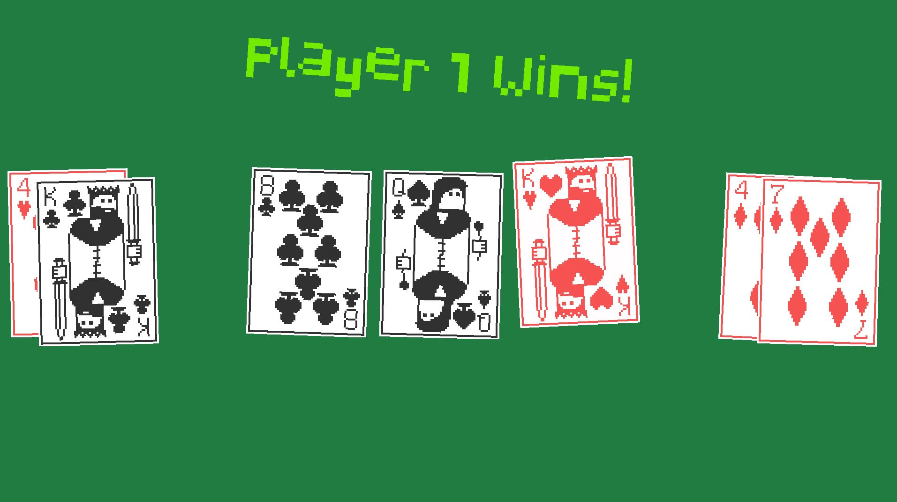

# pokerhands
Simple poker game that determines the best hand



## Instructions

Pygame and Python3 are required, as well as card images and font in graphics/

From cmd/PowerShell:

```sh
python main.py
```

## Resources:
Card audio: https://pixabay.com/sound-effects/search/card%20dealing/  
Card images: https://zxyonitch.itch.io/pixel-playing-cards-52-cards-card-back  
Hand Ranking algorithm: https://codereview.stackexchange.com/questions/128702/poker-hands-in-python  
Pixelated Display font: https://www.dafont.com/pixelated-display.font  
